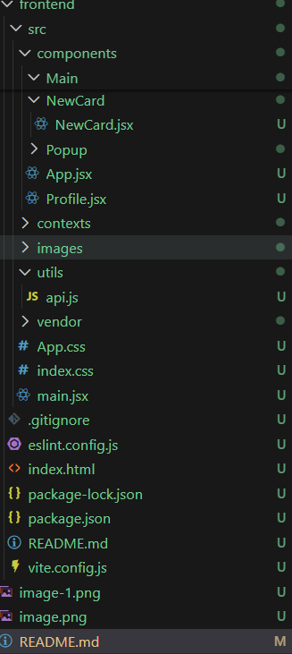
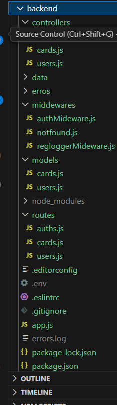

#  WEB PROJECT API FULL
O meu ultimo projeto no Bootcamp da Tripleten Brasil Um projeto que desevolvi  durante os ultimos sprinpts
# Objetivo do projeto
Criar um projeto full stack,
 .Primeira foi feito só com javascript, Html e CSS
 .depois fiz a revaturação do mesmo para usar o React

 ## Estrutura do projeto
  HTML
  CSS
  JavaScript
  React + Vite

